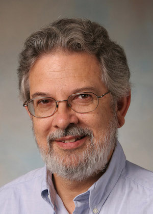

## BruceFest

{: style="height=200px; margin-right:10px; float: left"}

Over a career spanning six decades, Kim has had an amazing impact as a researcher, educator, and community builder. We are planning a one-day workshop at Pomona College in early January 2023, just before POPL. The workshop will feature with contributed talks on topics related to Kim's interests (object-oriented programming, natural language semantics, pedagogy). We have made arrangements to publish post-proceedings as an edited volume in Dagstuhl's [OASIcs series](https://www.dagstuhl.de/en/publications/oasics/). We hope you will join us to celebrate Kim's career

## Agenda

TBD

## Travel

TBD

## Hotels

TBD

## Organizers

* Andrew Black (Portland State)
* Nate Foster (Cornell)
* Michael Greenberg (Stevens)
* James Noble (Victoria)
