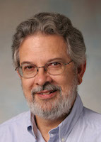
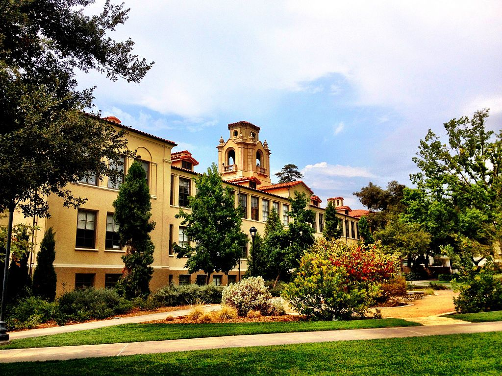

## BruceFest --- Friday, January 13th, 2023

{: style="margin-right:10px; float: left"}

Over a career spanning six decades, Kim has had an amazing impact as a researcher, educator, and community builder. We are planning a one-day workshop at Pomona College on **Friday, January 13th, 2023**, just before POPL. The workshop will feature contributed talks on topics related to Kim's interests (object-oriented programming, natural language semantics, pedagogy). We have made arrangements to publish post-proceedings as an edited volume in Dagstuhl's [OASIcs series](https://www.dagstuhl.de/en/publications/oasics/). We hope you will join us to celebrate Kim's career

## Location
[Estella 1051/Argue Auditorium](https://www.pomona.edu/map/?id=523#!m/54436) at Pomona College, Claremont, CA

<small>Photo Credit: [Nostalgicwisdom](https://commons.wikimedia.org/w/index.php?title=User:Nostalgicwisdom&action=edit&redlink=1) under a [CC BY-SA 3.0](https://creativecommons.org/licenses/by-sa/3.0/deed.en) license.</small>

<iframe src="https://www.pomona.edu/map/?id=523#!m/54436" width="100%" height="750px" frameBorder="0" scrolling="no" border="0" style="border:0px solid #fff; margin:0; padding:0;"></iframe>

## Agenda for Friday, January 13th, 2023

| Time | Topic |
| :---------- | :------------------------------------------------- |
| 8am-9am | *Breakfast* |
| 9am–10:00am |  Introduction
| 10am–10:30am | The Remaining Troublespots in Grace (Andrew Black)  |
| 10:30am–11am | *Coffee break*  |
| 11am–11:30am | Gradual typing in the Thorn Language (Jan Vitek) |
| 11:30am–12pm | OO and Other Things (James Noble) |
| 12pm–2pm | *Lunch* |
| 2pm–2:30pm | Pedagogy and Quantum Computing (Jens Palsberg) |
| 2:30pm–3pm | On Teaching Semantics (Kathi Fisler) |
| 3pm–3:30pm | Formal Foundations and Building Communities (Nate Foster) |
| 3:30pm–4pm | *Coffee break* |
| 4pm–5pm | Reminiscences |
| 5pm–6pm | *Cocktail hour* |
| 6:30pm–    | *Dinner at [Uno Tre Otto](https://www.unotreotto.com/)* |

## Travel

Pomona College is in Claremont, CA, in the northeast corner of Los Angeles County. The Ontario, California airport (ONT) provides convenient access (<20min taxi), though LAX, BUR, LGB, and SNA are all within a 1-2 hour drive.

## Hotels

The [Doubletree](https://www.hilton.com/en/hotels/ontcldt-doubletree-claremont/) and [Casa 425](https://www.casa425.com/) are both recommended.

## Organizers

* [Andrew Black (Portland State)](http://web.cecs.pdx.edu/~black/)
* [Nate Foster (Cornell)](https://www.cs.cornell.edu/~jnfoster/)
* [Michael Greenberg (Stevens)](https://greenberg.science/)
* [James Noble (Victoria)](https://homepages.ecs.vuw.ac.nz/~kjx/)
